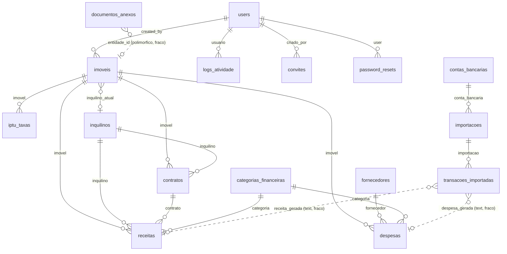

# Fase 2 — Modelagem de Dados

Fonte da verdade: `pocketbase/migrations/` (17 migrações) e `pocketbase/schema.json`
(snapshot). **17 coleções**, sendo 1 `auth` e 16 `base`.

> Esta modelagem está **concluída e validada** — pré-requisito declarado pela diretriz para a assinatura
> dos contratos de API na [Fase 3](03-api/openapi.yaml).

> **Atualização de 17/09/2026.** Esta modelagem descreve o backend PocketBase, hoje substituído
> por um Postgres no Supabase ([ADR-0009](05-adr/0009-supabase-como-backend.md)). O esquema
> equivalente, com os débitos RD-01, RD-04, RD-08 e RD-09 já resolvidos, está em
> [`supabase/migrations/`](../supabase/migrations) e resumido em
> [`supabase/README.md`](../supabase/README.md).

---

## 1. Convenções gerais

| Convenção            | Regra                                                                                                     |
| :------------------- | :-------------------------------------------------------------------------------------------------------- |
| Identificador        | `id` — string de 15 caracteres gerada pelo PocketBase (não sequencial, seguro para exposição)             |
| Timestamps           | `created` / `updated` do tipo `autodate`, gerenciados pela plataforma                                     |
| Autoria              | `created_by` / `updated_by` → relação com `users`, `cascadeDelete: false` (histórico preservado)          |
| Idioma               | Nomes de coleção e campo em **português**, sem acento, `snake_case`                                       |
| Valores monetários   | `number` (float64 no SQLite). ⚠️ Ver restrição RD-01 abaixo                                               |
| Datas                | `date` (ISO 8601). Exceção: `password_resets.expires_at` é `text` — ver RD-02                             |
| Competência contábil | `competencia` como `text` no formato `YYYY-MM`                                                            |
| Anexos               | `file` na própria coleção (`fotos`, `documento`, `comprovante`) **ou** polimórfico em `documentos_anexos` |

---

## 2. Coleções

### 2.1 `users` — identidade _(auth)_

| Campo                                       | Tipo                    | Notas                                     |
| :------------------------------------------ | :---------------------- | :---------------------------------------- |
| `email`, `password`, `tokenKey`, `verified` | (nativos do PocketBase) | `email` único quando não vazio            |
| `name`                                      | text                    |                                           |
| `avatar`                                    | file                    |                                           |
| `perfil`                                    | select                  | `administrador` \| `usuario`              |
| `ativo`                                     | bool                    | `false` derruba a sessão no `authRefresh` |
| `permissoes`                                | **json**                | Array de `{ modulo, nivel }` — ver 2.2    |

Índices: únicos em `tokenKey` e em `email` (parcial, `WHERE email != ''`).

### 2.2 Estrutura de `users.permissoes`

```ts
type ModuloPermissao =
  | 'imoveis'
  | 'inquilinos'
  | 'fornecedores'
  | 'contratos'
  | 'receitas'
  | 'despesas'
  | 'iptu_taxas'
  | 'dashboards'
  | 'alertas'
  | 'relatorios'
  | 'importar_extrato'
  | 'classificar_transacoes'

type NivelPermissao = 'sem_acesso' | 'visualizacao' | 'edicao'

type Permissoes = Array<{ modulo: ModuloPermissao; nivel: NivelPermissao }>
```

**Decisão de modelagem (e seu custo):** guardar autorização como blob JSON é conveniente para o cliente
(uma leitura resolve o menu inteiro) e **inútil para o servidor** — uma API rule do PocketBase não
consulta o interior de um campo `json` de forma confiável, o que é a causa-raiz do RBAC client-side.
A normalização proposta está em [ADR-0003](05-adr/0003-rbac-servidor-e-tenancy.md): coleção
`permissoes` com `(usuario, modulo, nivel)` e índice único em `(usuario, modulo)`, consultável por rule.

### 2.3 Domínio patrimonial

**`imoveis`** — 26 campos. `endereco` obrigatório.
Endereço: `endereco`, `numero`, `complemento`, `bairro`, `cidade`, `estado`, `cep`.
Identificação: `codigo`, `nome`, `matricula`, `inscricao_imobiliaria`.
Físico: `area`, `quartos`, `banheiros`, `vagas`, `fotos` (file múltiplo).
Financeiro: `valor`, `valor_estimado`.
`tipo`: `casa` \| `apartamento` \| `sala_comercial` \| `loja` \| `galpao` \| `terreno` \| `outro`
(estendido pela migração 0005).
`status`: `vago` \| `alugado` \| `em_manutencao` \| `inativo` (0002 criava `ativo`/`inativo`; 0005 substituiu).
`inquilino_atual` → `inquilinos` (desnormalização de conveniência — ver RD-03).
Índices: `status`, `created`, `created_by`.

**`inquilinos`** — 17 campos. `nome` obrigatório; `tipo_pessoa`: `pf` \| `pj`.
PF: `cpf`, `rg`, `data_nascimento`. PJ: `cnpj`, `nome_fantasia`, `responsavel`.
`status`: `ativo` \| `inativo`. Índice **único parcial** em `cpf` (`WHERE cpf != ''`) — bom desenho:
impede duplicidade sem bloquear cadastro incompleto. ⚠️ **Não há índice equivalente para `cnpj`** (RD-04).

**`fornecedores`** — 15 campos. `cnpj_cpf` em campo único (sem unicidade), `tipo_fornecedor`,
`servicos_prestados`, `contato`.

### 2.4 Domínio contratual

**`contratos`** — 19 campos. `imovel` e `inquilino` **obrigatórios**.
Vigência: `data_inicio`, `data_fim`, `numero`, `status`: `ativo` \| `encerrado` \| `rascunho`.
Financeiro: `valor_aluguel`, `dia_vencimento`.
Reajuste: `indice_reajuste` (**text livre** — ver RD-05), `periodicidade_reajuste` (text),
`proxima_data_reajuste` (date).
Garantia: `tipo_garantia`, `valor_garantia`. Anexo: `documento` (file).
Índices: `imovel`, `inquilino`, `status`, `created`, `data_fim` (este último serve o alerta de
vencimento de contrato).

### 2.5 Domínio financeiro

As três coleções compartilham o mesmo desenho de competência — deliberado, para que dashboards e
relatórios usem a mesma lógica de agregação:

|                        | `receitas`                                  | `despesas`                              | `iptu_taxas`                             |
| :--------------------- | :------------------------------------------ | :-------------------------------------- | :--------------------------------------- |
| Vínculo obrigatório    | `imovel`                                    | `imovel`                                | `imovel`                                 |
| Contraparte            | `inquilino`, `contrato`                     | `fornecedor`                            | —                                        |
| Categoria              | `categoria` → `categorias_financeiras`      | idem                                    | `tipo`: `iptu`/`taxa_condominio`/`outro` |
| Previsto vs. realizado | `valor_previsto` / `valor_recebido`         | `valor_previsto` / `valor_pago`         | `valor`                                  |
| Data de liquidação     | `data_recebimento`                          | `data_pagamento`                        | `data_pagamento`                         |
| Vencimento             | `data_vencimento`                           | `data_vencimento`                       | `vencimento`                             |
| `status_financeiro`    | `previsto`/`recebido`/`em_atraso`/`parcial` | `previsto`/`pago`/`em_atraso`/`parcial` | —                                        |
| `status` (legado)      | `pago`/`pendente`                           | `pago`/`pendente`/`vencido`             | `pago`/`pendente`                        |
| Competência            | `competencia` (`YYYY-MM`)                   | idem                                    | `ano_referencia` (number)                |
| Origem na conciliação  | `transacao_importada_id`                    | `transacao_importada_id`                | —                                        |
| Comprovante            | —                                           | —                                       | `comprovante` (file)                     |

⚠️ **RD-06 — dois campos de status coexistem.** `status` (do desenho original) e `status_financeiro`
(introduzido pelas migrações 0009/0011) descrevem a mesma coisa com vocabulários diferentes. As duas
colunas estão indexadas e ambas são lidas pela UI. Débito técnico a resolver: eleger `status_financeiro`
como fonte única e migrar `status` para computado/derivado.

**`categorias_financeiras`** — `nome`, `tipo` (`receita` \| `despesa`), `status`. Seeds nas migrações
0010 (receitas) e 0012 (despesas).

### 2.6 Domínio de conciliação bancária

**`contas_bancarias`** — `nome` (obrigatório), `banco`, `agencia`, `conta`,
`tipo`: `Conta Corrente` \| `Conta Poupança` \| `Conta Investimento` \| `Outros`, `saldo_inicial`, `ativo`.
⚠️ **RD-07:** `agencia` e `conta` são dados sensíveis em texto claro; ver [06-seguranca.md](06-seguranca.md).

**`importacoes`** — cabeçalho do lote. `conta_bancaria`, `arquivo_nome` e `formato`
(`csv` \| `ofx`) obrigatórios; `data_importacao`; contadores `total_transacoes`,
`transacoes_classificadas`, `transacoes_ignoradas`; `status`: `pendente` \| `concluida` \| `parcial`.

**`transacoes_importadas`** — 24 campos, o coração do diferencial competitivo.
Obrigatórios: `importacao`, `data`, `descricao`, `valor`, `tipo` (`credito` \| `debito`).
Estado: `classificada`, `ignorada` (bool).
Deduplicação: `duplicata_detectada` (bool), `duplicata_ids` (**json**, array de ids).
Sugestão do motor: `sugestao_tipo` (`receita`/`despesa`), `sugestao_categoria` + `sugestao_categoria_id`,
`sugestao_imovel` + `sugestao_imovel_id`, `sugestao_confianca` (number 0–1).
Resultado: `categoria_classificada`, `imovel_classificado`, `receita_gerada`, `despesa_gerada`.
Índices: `importacao`, `data DESC`, `classificada`, `ignorada`.

⚠️ **RD-08 — referências fracas.** `sugestao_*_id`, `categoria_classificada`, `imovel_classificado`,
`receita_gerada`, `despesa_gerada` são `text`, não `relation`. Não há integridade referencial: apagar uma
receita deixa `receita_gerada` apontando para o vazio, e o inverso — `receitas.transacao_importada_id`
também é `text`. O par forma um vínculo bidirecional **sem** garantia do banco. Mitigação mínima:
validação em hook `onRecordBeforeDelete` e um job de reconciliação.

### 2.7 Governança, identidade e auditoria

**`documentos_anexos`** — anexo polimórfico: `entidade_tipo` (select), `entidade_id` (text),
`arquivo` (file), `descricao`, `status`. Índices em `entidade_tipo` e `entidade_id`.
Mesma ressalva do RD-08: polimorfismo por `text` não tem integridade referencial.

**`convites`** — `email`, `token`, `perfil` (`administrador`\|`usuario`), `status`
(`pendente`\|`aceito`\|`cancelado`\|`expirado`), `data_expiracao`, `criado_por` — todos obrigatórios
exceto `criado_por`. `token` **único**. Índices em `email`, `status`, `data_expiracao`.

**`password_resets`** — `user`, `email`, `token`, `status` (`pendente`\|`utilizado`\|`expirado`),
`expires_at`. `token` **único**.
⚠️ **RD-02:** `expires_at` é `text`, não `date` — comparação de expiração fica sujeita a
string-compare. Só funciona com ISO 8601 rigorosamente normalizado em UTC. Corrigir para `date`.

**`logs_atividade`** — `usuario` (relação), `acao` (text, obrigatório), `entidade` (text, obrigatório),
`detalhes` (text livre). Índices em `usuario`, `acao`, `entidade`, `created`.
Escrito exclusivamente por hooks (`audit_*.js`). ⚠️ `detalhes` é prosa concatenada — ver RD-09.

---

## 3. Diagrama de relacionamentos



Linha contínua = relação com integridade referencial. **Linha pontilhada = vínculo por `text`, sem
garantia do banco** (RD-08).

---

## 4. Restrições de modelagem e débitos identificados

| ID    | Restrição / débito                                                                                                              | Severidade | Ação                                                                                                                                                    |
| :---- | :------------------------------------------------------------------------------------------------------------------------------ | :--------- | :------------------------------------------------------------------------------------------------------------------------------------------------------ |
| RD-01 | Monetários em `number` (float64). O domínio fiscal usa aritmética em centavos (`FinancialMath`), mas a **persistência** é float | Alta       | Persistir centavos (inteiro) ou validar arredondamento na borda de escrita                                                                              |
| RD-02 | `password_resets.expires_at` é `text`                                                                                           | Média      | Migrar para `date`                                                                                                                                      |
| RD-03 | `imoveis.inquilino_atual` duplica informação derivável do contrato ativo                                                        | Baixa      | Manter como cache, sincronizado por hook; nunca como fonte da verdade                                                                                   |
| RD-04 | Sem índice único em `inquilinos.cnpj` (existe para `cpf`)                                                                       | Média      | Criar índice único parcial `WHERE cnpj != ''`                                                                                                           |
| RD-05 | `indice_reajuste` e `periodicidade_reajuste` são text livre                                                                     | Média      | Converter em `select` (`igpm`, `ipca`, `incc`, `fixo`) — pré-requisito da automação de reajuste (RN-CTR-02)                                             |
| RD-06 | `status` e `status_financeiro` redundantes em receitas/despesas                                                                 | Média      | Eleger `status_financeiro`; descontinuar `status`                                                                                                       |
| RD-07 | Dados bancários (`agencia`, `conta`) em texto claro                                                                             | Alta       | Mascarar na UI/logs; avaliar cifra em repouso                                                                                                           |
| RD-08 | Vínculos de conciliação e anexos por `text`, sem FK                                                                             | Alta       | Converter para `relation` onde possível; hook de integridade no delete                                                                                  |
| RD-09 | `logs_atividade.detalhes` é prosa concatenada                                                                                   | Média      | Adicionar `payload` json estruturado (sem PII) mantendo `detalhes` como rótulo legível                                                                  |
| RD-10 | **Nenhuma coleção tem campo de tenant/owner**                                                                                   | Crítica    | Decisão em [ADR-0003](05-adr/0003-rbac-servidor-e-tenancy.md): produto é single-org hoje; introduzir `owner`/`tenant` antes de qualquer cliente externo |

---

## 5. Coleções propostas (ainda não implementadas)

Derivadas das lacunas competitivas do [benchmark](00-pesquisa-e-benchmark.md) e dos fluxos da Fase 1.
Modelagem a validar **antes** de codificar.

| Coleção              | Propósito                                                | Campos-chave                                                                                                               |
| :------------------- | :------------------------------------------------------- | :------------------------------------------------------------------------------------------------------------------------- |
| `permissoes`         | Normalizar `users.permissoes` para uso em API rule       | `usuario` (rel), `modulo` (select), `nivel` (select); único em (`usuario`,`modulo`)                                        |
| `indices_economicos` | Snapshot mensal de IGP-M / IPCA para reajuste automático | `indice` (select), `competencia`, `valor`, `fonte`, `coletado_em`                                                          |
| `reajustes`          | Histórico auditável de reajuste aplicado por contrato    | `contrato` (rel), `competencia`, `indice`, `percentual`, `valor_anterior`, `valor_novo`, `aplicado_por`                    |
| `cobrancas`          | Boleto/PIX emitido por lançamento                        | `receita` (rel), `provedor`, `id_externo`, `status`, `linha_digitavel`, `qr_code`, `vencimento`, `idempotency_key` (único) |
| `eventos_cobranca`   | Régua de cobrança (dedupe por etapa)                     | `cobranca` (rel), `etapa` (select `d-3`/`d+1`/`d+5`), `canal`, `enviado_em`, `status`; único em (`cobranca`,`etapa`)       |
| `assinaturas`        | Ciclo de assinatura digital do contrato                  | `contrato` (rel), `provedor`, `id_externo`, `status`, `signatarios` (json), `assinado_em`                                  |
| `simulacoes`         | Persistir simulação e laudo para auditoria futura        | `usuario` (rel), `parametros` (json), `resultado` (json), `laudo` (json), `versao_motor`, `base_legal`                     |
| `webhooks_recebidos` | Idempotência e replay de callbacks externos              | `provedor`, `evento`, `id_externo` (único), `assinatura_valida` (bool), `payload` (json), `processado_em`                  |
