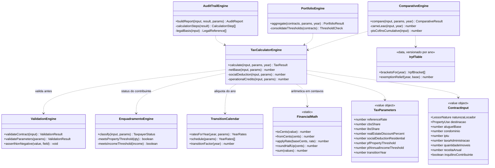
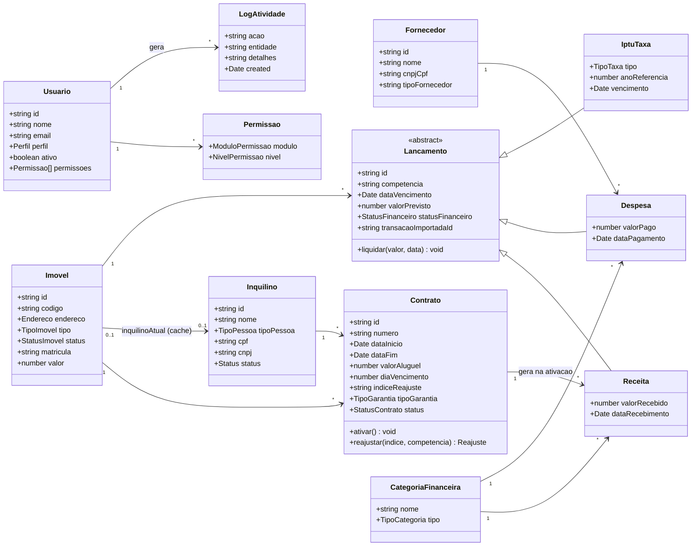
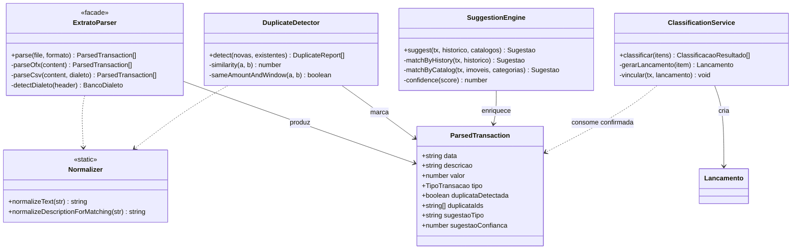
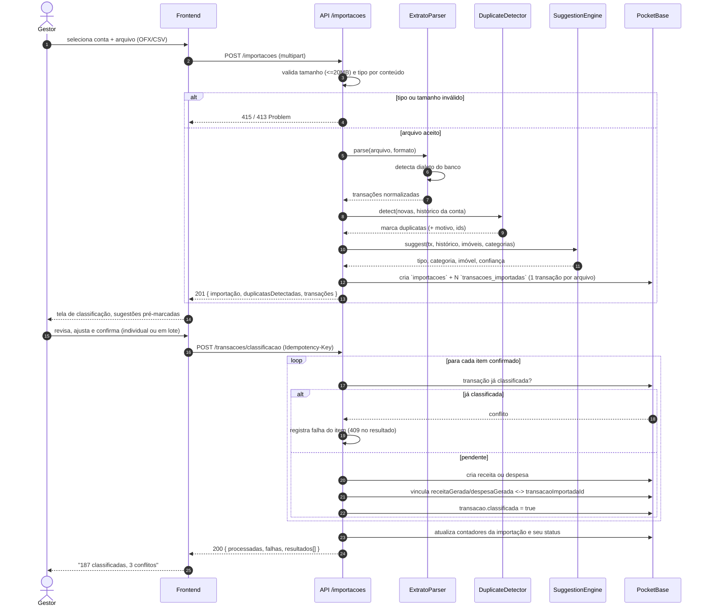
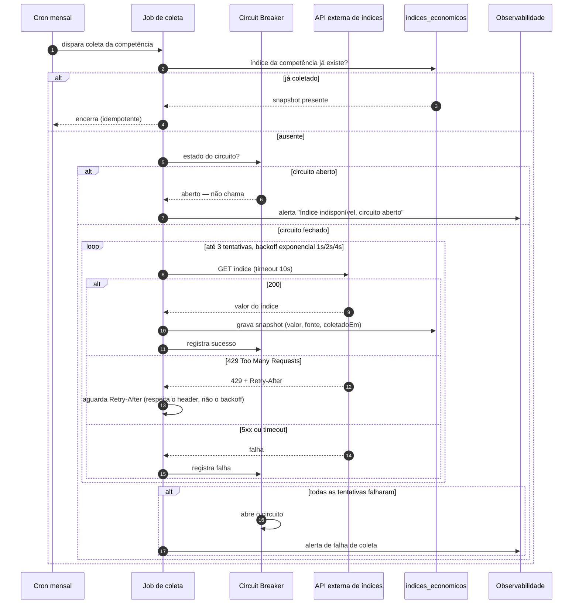

# Fase 4 — Modelagem Visual e UML

Diagramas em **Mermaid** (renderizam nativamente no GitHub). Refletem o código atual; onde descrevem
comportamento-alvo ainda não implementado, isso está marcado como **(proposto)**.

---

## 1. Diagramas de Classe

### 1.1 Núcleo tributário — `src/simulador/core/`

Domínio puro, sem nenhuma dependência de React ou DOM (NFR-03). Este é o ativo técnico mais valioso do
projeto e o que nenhum concorrente pesquisado possui.



**Leitura do diagrama.** `TaxCalculatorEngine` é o único ponto de entrada de cálculo; `Comparative`,
`Portfolio` e `AuditTrail` orquestram sobre ele, nunca reimplementam regra. `IrpfTable` só é alcançada
pelo `ComparativeEngine` — é o que garante a restrição de que nenhuma alíquota de IRPF vive fora dela.

### 1.2 Domínio de gestão imobiliária



> `Lancamento` é abstração de **modelagem**, não de persistência: `receitas`, `despesas` e `iptu_taxas`
> são coleções separadas que compartilham o mesmo contrato de competência. A herança existe para que
> dashboards e relatórios agreguem os três com uma única lógica.

### 1.3 Motor de conciliação bancária — `src/lib/extratos-engine.ts`



Dialetos suportados hoje: **OFX** e CSV de **Itaú, Bradesco, Nubank, Inter, Santander e Banco do Brasil**.

---

## 2. Diagramas de Sequência — fluxos críticos

### 2.1 Autenticação com rotação de refresh token **(proposto — ADR-0004)**

Implementa RFC 9700 / OAuth 2.1: cada uso do refresh emite um novo e invalida o anterior; reuso de token
invalidado revoga a família inteira.

```mermaid
sequenceDiagram
    autonumber
    actor U as Usuário
    participant C as Cliente (web/mobile)
    participant API as API /auth
    participant AS as Token Store (famílias)
    participant DB as PocketBase

    U->>C: e-mail + senha
    C->>API: POST /auth/login
    API->>API: rate limit por IP e por conta
    API->>DB: autentica credencial
    DB-->>API: usuário + perfil + ativo

    alt conta desativada (ativo = false)
        API-->>C: 403 Problem (conta desativada)
    else credencial válida
        API->>DB: resolve permissões efetivas
        API->>AS: cria família F, emite access (15 min) + refresh R1
        alt cliente web
            API-->>C: 200 + access; Set-Cookie refresh HttpOnly Secure SameSite=Strict
        else cliente mobile
            API-->>C: 200 + access + refresh
            C->>C: grava refresh no Keychain / Keystore
        end
    end

    Note over C,API: 15 minutos depois, access expira

    C->>API: POST /auth/refresh (R1)
    API->>AS: valida R1 na família F
    alt R1 válido e não usado
        AS->>AS: invalida R1, emite R2 na família F
        API-->>C: 200 + novo access + R2
    else R1 já usado (indício de roubo de token)
        AS->>AS: revoga TODA a família F
        API-->>C: 401 Problem (reautenticação obrigatória)
        C->>C: limpa armazenamento seguro
        C-->>U: redireciona para login
    end
```

### 2.2 Ativação de contrato e geração das receitas da vigência

Operação composta, atômica e idempotente — hoje feita no cliente, sem nenhuma dessas três garantias.

```mermaid
sequenceDiagram
    autonumber
    actor U as Gestor
    participant C as Frontend
    participant API as POST /contratos/{id}/ativacao
    participant AZ as Autorização (servidor)
    participant TX as Transação
    participant DB as PocketBase
    participant H as Hooks de auditoria

    U->>C: "Ativar contrato"
    C->>API: Idempotency-Key: uuid
    API->>AZ: nível em `contratos` >= edicao?
    alt sem_acesso ou visualizacao
        AZ-->>C: 403 Problem
    else edicao
        API->>DB: chave de idempotência já processada?
        alt já processada
            DB-->>API: resultado anterior
            API-->>C: 200 (mesma resposta, sem reexecutar)
        else primeira execução
            API->>DB: imóvel tem outro contrato ativo no período?
            alt conflito de ocupação
                DB-->>API: contrato concorrente
                API-->>C: 409 Problem
            else livre
                TX->>DB: contrato.status = ativo
                TX->>DB: imovel.status = alugado; imovel.inquilinoAtual = inquilino
                loop para cada competência da vigência
                    TX->>DB: cria receita (competência, dataVencimento, valorPrevisto)
                end
                TX->>DB: grava chave de idempotência
                TX-->>API: commit
                DB->>H: onRecordAfterUpdateSuccess(contratos)
                H->>DB: log em logs_atividade
                API-->>C: 200 { contrato, receitasGeradas: 12 }
                C-->>U: "Contrato ativado — 12 receitas previstas"
            end
        end
    end
```

### 2.3 Importação de extrato e classificação assistida

O diferencial competitivo do produto. A sugestão do motor é **consultiva**: nenhum lançamento nasce sem
confirmação humana (RN-IMP-02).



### 2.4 Consumo de API externa com rate limit, retry e fallback

A tributação IBS/CBS é calculada **localmente** (tabela versionada em código), portanto não tem modo de
falha de rede. A dependência externa real do domínio fiscal/financeiro é o **índice de reajuste**
(IGP-M / IPCA). Este é o padrão obrigatório para toda integração externa do sistema.



E o consumo desse snapshot pelo reajuste — que **recusa** em vez de estimar:

```mermaid
sequenceDiagram
    autonumber
    actor U as Gestor
    participant API as POST /contratos/{id}/reajuste
    participant DB as indices_economicos
    participant TX as Transação

    U->>API: reajustar competência 2026-09 por IGP-M
    API->>DB: snapshot do IGP-M em 2026-09?
    alt snapshot ausente
        DB-->>API: nada
        API-->>U: 424 Failed Dependency — "índice indisponível; contrato inalterado"
        Note over API,U: jamais reajustar com índice estimado — erro aqui vira disputa contratual
    else snapshot presente
        DB-->>API: percentual + fonte
        TX->>DB: registra `reajustes` (valorAnterior, valorNovo, índice, fonte)
        TX->>DB: contrato.valorAluguel = novo; proximaDataReajuste += periodicidade
        TX-->>API: commit
        API-->>U: 200 { reajuste aplicado, fonte declarada }
    end
```

### 2.5 Autorização por módulo no servidor **(proposto — ADR-0003)**

O fluxo que corrige o achado crítico: hoje a decisão acontece só no cliente.

```mermaid
sequenceDiagram
    autonumber
    participant C as Cliente
    participant API as Endpoint de negócio
    participant RULE as API Rule / hook
    participant PERM as Coleção `permissoes`
    participant DB as Coleção de negócio

    C->>API: GET /receitas (Bearer access token)
    API->>RULE: avalia autorização
    RULE->>PERM: nível de (usuario, 'receitas')
    alt sem registro ou nivel = sem_acesso
        PERM-->>RULE: sem_acesso (fail-closed)
        RULE-->>C: 403 Problem
    else nivel = visualizacao
        PERM-->>RULE: visualizacao
        RULE->>DB: permite GET; bloqueia POST/PATCH/DELETE
        DB-->>C: 200 página de receitas
    else nivel = edicao
        PERM-->>RULE: edicao
        RULE->>DB: permite todos os métodos
        DB-->>C: 200 / 201
    end

    Note over C,RULE: O menu do cliente continua usando /auth/me,<br/>mas ele é cosmético — a decisão é sempre aqui.
```

---

## 3. Rastreabilidade dos diagramas

| Diagrama                 | Código / documento de origem                                                                        |
| :----------------------- | :-------------------------------------------------------------------------------------------------- |
| 1.1 Núcleo tributário    | `src/simulador/core/{domain,services}/*`                                                            |
| 1.2 Domínio de gestão    | `pocketbase/migrations/*`, [Fase 2](02-modelagem-de-dados.md)                                       |
| 1.3 Conciliação          | `src/lib/extratos-engine.ts`                                                                        |
| 2.1 Autenticação         | `src/hooks/use-auth.tsx` + [ADR-0004](05-adr/0004-tokens-e-sessao.md)                               |
| 2.2 Ativação de contrato | `pocketbase/hooks/on_contrato_create.js`, `src/services/contratos.ts`                               |
| 2.3 Importação           | `src/pages/ImportarExtrato.tsx`, `ClassificarTransacoes.tsx`, `src/services/importacoes.ts`         |
| 2.4 Índices externos     | Fase 1 §4 + [ADR-0007](05-adr/0007-integracoes-externas.md)                                         |
| 2.5 Autorização          | `src/hooks/use-auth.tsx`, `ProtectedRoute.tsx` + [ADR-0003](05-adr/0003-rbac-servidor-e-tenancy.md) |
