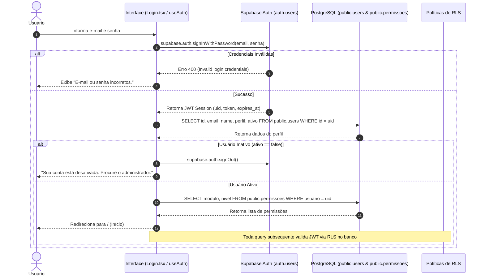
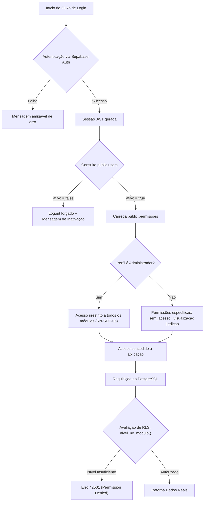

[[_TOC_]]

## Objetivo
Garantir autenticação segura, gestão centralizada de sessões, controle de acesso baseado em módulos e permissões (RBAC fail-closed) e ciclo de vida controlado de usuários e convites para a plataforma patrimonial da Holding Aguiar.

## Contexto  
  
O ecossistema de autenticação e controle de acesso opera sobre o **Supabase Auth (GoTrue)** integrado diretamente ao motor relacional PostgreSQL. A camada de identidade é dividida entre o schema de segurança `auth.users` (onde residem credenciais, hashes criptográficos e sessões JWT) e as tabelas de aplicação `public.users` e `public.permissoes`.  

No frontend React 19 / TypeScript, o estado de sessão é gerenciado pelo hook [`use-auth.tsx`](file:///Users/francisco.junior/Documents/antigravity/charming-salk/src/hooks/use-auth.tsx), consumido pelas rotas protegidas em [`ProtectedRoute.tsx`](file:///Users/francisco.junior/Documents/antigravity/charming-salk/src/components/layout/ProtectedRoute.tsx) e telas de acesso: [`Login.tsx`](file:///Users/francisco.junior/Documents/antigravity/charming-salk/src/pages/Login.tsx), [`Signup.tsx`](file:///Users/francisco.junior/Documents/antigravity/charming-salk/src/pages/Signup.tsx), [`RecuperarSenha.tsx`](file:///Users/francisco.junior/Documents/antigravity/charming-salk/src/pages/RecuperarSenha.tsx) e [`ResetarSenha.tsx`](file:///Users/francisco.junior/Documents/antigravity/charming-salk/src/pages/ResetarSenha.tsx).  

A autorização é estrita: a interface esconde botões e rotas por conveniência visual, mas a **garantia real de acesso é executada no banco de dados via Row Level Security (RLS)** através da função `nivel_no_modulo(auth.uid(), modulo)`.

---  
  
## Fluxo Atual (Autenticação e Carregamento de Permissões)  
 

---  
  
### O Problema  
  
No estágio anterior da plataforma (arquitetura sobre PocketBase legado e versões preliminares), foram identificadas vulnerabilidades críticas de segurança que exigiram reestruturação completa da esteira de identidade:
  
| Cenário | Comportamento esperado | Comportamento real (Legado) |  
|---|---|---|  
| Solicitação de recuperação de senha | E-mail enviado com link de uso único; nenhuma credencial exposta na rede | O endpoint retornava o token de reset no próprio corpo JSON da resposta HTTP, permitindo que qualquer pessoa redefinisse a senha de terceiros (Achado S-01) |  
| Acesso à API por usuário autenticado | O banco de dados recusa operações em módulos onde o usuário não possui permissão | O RBAC era checado apenas na interface React. No servidor, a regra era `@request.auth.id != ''`, permitindo que qualquer usuário autenticado alterasse contratos e extratos via API (Achado S-02) |  
| Consulta de permissão para usuário sem registro | Falhar fechando (*fail-closed*): bloqueio total de acesso | A função `getModulePermission()` retornava `'edicao'` quando a lista de permissões vinha vazia (*fail-open*) |  
| Subida do sistema sem envs de produção | Bloqueio de inicialização por ausência de credenciais válidas | O sistema caía silenciosamente em modo *mock*, permitindo acesso com qualquer credencial fictícia (Achado S-03) |  
  
**Resultado:** Risco severo de sequestro de contas administrativas, vazamento patrimonial e permissões client-side contornáveis por qualquer ferramenta de requisição HTTP (curl/Postman).  
  
---  
  
## Fluxo Proposto (V2 — Arquitetura Robusta com Supabase & RLS)  
  

---  

## Rastreabilidade aprimorada e Ciclo de Vida do Usuário

O ciclo de vida de acesso de um usuário no sistema segue este caminho rastreável:  
**`CONVITE_PENDENTE → CONVITE_ACEITO → ATIVO → INATIVO`**  
  
| Transição | Quando ocorre |  
|---|---|  
| `(criação)` → `CONVITE_PENDENTE` | Administrador emite convite com perfil definido via tela de Usuários (`convites.ts`) |  
| `CONVITE_PENDENTE` → `CONVITE_ACEITO` | Convidado cadastra senha dentro do prazo de 7 dias via link assinado (`validar_convite()`) |  
| `CONVITE_ACEITO` → `ATIVO` | Criação síncrona do registro em `public.users` herdando o perfil atribuído |  
| `ATIVO` → `INATIVO` | Administrador desativa a conta; sessões ativas são invalidadas no próximo ciclo de refresh |  
| `CONVITE_PENDENTE` → `EXPIRADO` | Decorridos 7 dias sem confirmação; exige renovação explícita pelo administrador |  

### **1. Validação de Permissões Fail-Closed no PostgreSQL**  
  
As políticas de RLS invocam a função segura `nivel_no_modulo(auth.uid(), 'modulo')`:  
- Se o usuário não possui registro em `public.permissoes` para aquele módulo, a função retorna `sem_acesso`.  
- Se o usuário estiver marcado como `ativo = false`, a função retorna `sem_acesso` para todas as chamadas.  
- Administradores ativos recebem bypass automático (`edicao` irrestrito) sem necessidade de registros na tabela de permissões (`RN-SEC-06`).  
  
### **2. Tratamento de Exceções e Proteção contra Elevação de Privilégios**  
  
| Evento | Tratamento do Sistema | Regra Aplicada |  
|---|---|---|  
| Tentativa de auto-promoção para Administrador | Gatilho `tg_proteger_privilegio` bloqueia a atualização se `auth.uid() == target_user_id` e cancela a transação | `RN-SEC-03` |  
| Alteração de permissão de terceiros por usuário comum | RLS na tabela `public.permissoes` restringe escrita exclusivamente a administradores ativos | `RN-SEC-01` |  
| Token de convite expirado (> 7 dias) | Função RPC `validar_convite()` recusa o token e instrui o usuário a contatar o administrador | `RN-SEC-04` |  
| Sessão órfã após exclusão no Auth | Trigger com `on delete cascade` limpa os registros correspondentes em `public.users` e `public.permissoes` | Integridade relacional |  

---

## Comparativo V1 x V2
  
| Critério | V1 —> PocketBase Legado | V2 —> Supabase Auth + RLS |  
|---|---|---|  
| Armazenamento de credenciais | Tabela local de usuários com hooks em JS | Schema isolado `auth.users` com Bcrypt/Argon2 |  
| Avaliação de autorização | Client-side no React (menu escondido) | Row Level Security (RLS) diretamente no motor PostgreSQL |  
| Recuperação de senha | Token trafegava na resposta HTTP aberta | E-mail assinado transacional com token temporário seguro |  
| Concessão de permissões | JSON blob dentro da coluna de usuário | Tabela relacional normalizada `public.permissoes` |  
| Tratamento de falhas | *Fail-open* (sem registro assumia edição) | *Fail-closed* (sem registro bloqueia qualquer leitura/escrita) |  
| Auditoria de privilégios | Inexistente | Gatilho automático grava histórico em `public.logs_atividade` |  

---  
  
## Importante (Impacto e Observações)
  
- **Primeiro Administrador:** O primeiro usuário administrador deve ser promovido exclusivamente via script/SQL Editor no provisionamento do banco.  
- **Desativação Imediata:** Um usuário desativado tem seu acesso a dados cortado instantaneamente no banco de dados mesmo que mantenha um token JWT válido no navegador, graças à verificação `ativo = true` na função de RLS.  
- **Independência de UI:** Nenhuma alteração no código React é capaz de burlar o isolamento das tabelas; todas as chamadas sem a respectiva linha de permissão retornam erro `42501` do PostgreSQL.
