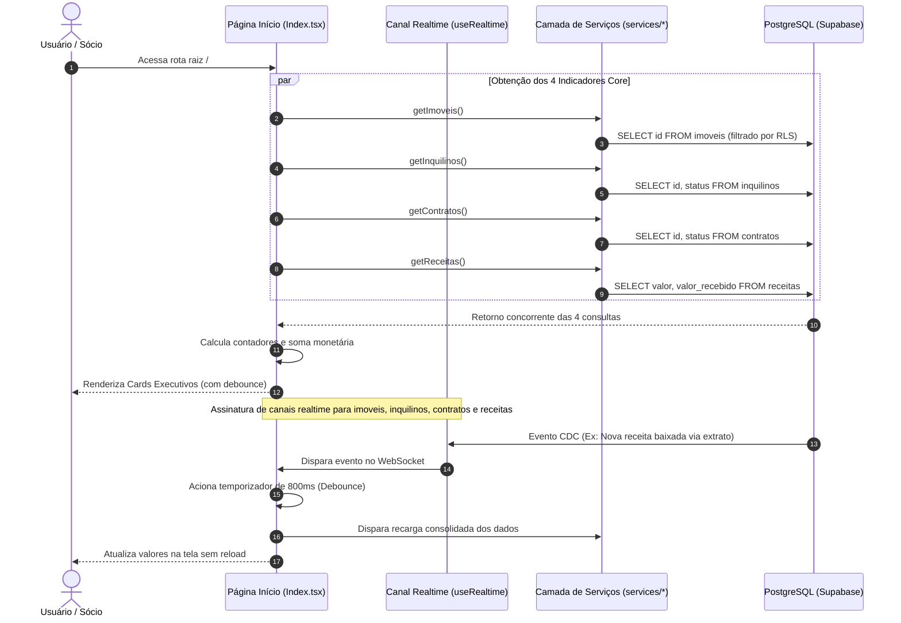
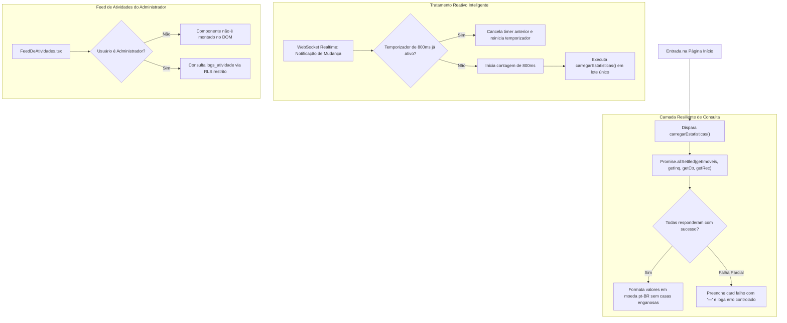

[[_TOC_]]

## Objetivo
Centralizar a visão executiva e operacional do patrimônio da Holding Aguiar, disponibilizando indicadores consolidados em tempo real (imóveis cadastrados, inquilinos ativos, contratos vigentes e receitas recebidas), feed ao vivo de eventos de auditoria e monitoramento contínuo da saúde técnica da aplicação.

## Contexto  
  
A tela inicial ([`Index.tsx`](file:///Users/francisco.junior/Documents/antigravity/charming-salk/src/pages/Index.tsx)) funciona como o ponto de convergência de todos os módulos operacionais da plataforma. Ela atende prioritariamente aos sócios da holding e administradores, apresentando números executivos sem complexidade contábil desnecessária.  

A obtenção de dados ocorre via agregação assíncrona consumindo os serviços [`imoveis.ts`](file:///Users/francisco.junior/Documents/antigravity/charming-salk/src/services/imoveis.ts), [`inquilinos.ts`](file:///Users/francisco.junior/Documents/antigravity/charming-salk/src/services/inquilinos.ts), [`contratos.ts`](file:///Users/francisco.junior/Documents/antigravity/charming-salk/src/services/contratos.ts) e [`receitas.ts`](file:///Users/francisco.junior/Documents/antigravity/charming-salk/src/services/receitas.ts).  

A sincronização em tempo real é sustentada pelo hook [`use-realtime.ts`](file:///Users/francisco.junior/Documents/antigravity/charming-salk/src/hooks/use-realtime.ts), conectado ao Supabase Realtime via WebSockets sobre canais protegidos por RLS. Na mesma tela, administradores têm acesso ao componente [`FeedDeAtividades.tsx`](file:///Users/francisco.junior/Documents/antigravity/charming-salk/src/components/inicio/FeedDeAtividades.tsx), alimentado pela tabela de trilha de auditoria `public.logs_atividade`.

---  
  
## Fluxo Atual (Carregamento e Agregação Reativa)  
 

---  
  
### O Problema  
  
Durante a operação diária da holding e importações financeiras em lote, identificou-se a necessidade de mitigar riscos de sobrecarga e inconsistência visual:
  
| Cenário | Comportamento esperado | Comportamento real (Sem Governança) |  
|---|---|---|  
| Importação em lote de extrato com 150 lançamentos | A tela agrupa as notificações e executa apenas uma recarga ao final | Sem debounce estrito, a interface disparava 150 recargas concorrentes de todos os indicadores, causando lentidão no navegador e flicker visual |  
| Falha temporária em uma das 4 chamadas de API | Exibir traço (`—`) de indisponibilidade no card afetado e manter os demais | A falha em um serviço derrubava o estado geral e exibia "R$ 0,00", induzindo o sócio a achar que a holding estava sem receita |  
| Usuário com permissão parcial (ex: vê Imóveis mas não Receitas) | Ocultar ou neutralizar o card de Receitas sem quebrar a tela | Consultas sem tratamento de erro disparavam exceção não tratada na promise, bloqueando a renderização do Início |  
| Feed de auditoria exibindo detalhes internos | Apenas administradores devem ver eventos de permissões e segurança | Se a tabela `logs_atividade` não possuísse RLS restritivo, usuários operacionais veriam alterações confidenciais de privilégios |  
  
**Resultado:** Risco de degradação de performance do cliente sob cargas intensas de extratos e exibição de saldos zerados enganosos em momentos de oscilação de rede.  
  
---  
  
## Fluxo Proposto (V2 — Agregação Resiliente com Debounce e RLS)  
  

---  

## Rastreabilidade e Ciclo de Atualização Reativa

O ciclo de vida da informação apresentada no painel principal segue esta esteira determinística:  
**`ALTERACAO_PERSISTIDA → DISPARO_CDC → FILTRO_WEBSOCKET → TEMPORIZADOR_DEBOUNCE → CONSOLIDACAO_UI`**  
  
| Transição | Quando ocorre |  
|---|---|  
| `ALTERACAO_PERSISTIDA` | Um registro é inserido ou modificado nas tabelas `imoveis`, `inquilinos`, `contratos` ou `receitas` |  
| `DISPARO_CDC` | A extensão Realtime do PostgreSQL emite payload CDC no canal WebSocket |  
| `FILTRO_WEBSOCKET` | O hook `useRealtime` recebe o pacote referente à tabela monitorada |  
| `TEMPORIZADOR_DEBOUNCE` | A página agenda a recarga com janela de 800 milissegundos (`ESPERA_DA_RECARGA_MS`) |  
| `CONSOLIDACAO_UI` | As estatísticas são recalculadas e os cards exibem o valor atualizado |  

### **1. Princípio da Informação Segura: "Zero Números Inventados"**  
  
Se a conexão com a API falhar ou a resposta de receitas estiver corrompida:  
- O estado inicial assume `ESTATISTICAS_VAZIAS` (`{ imoveis: '—', inquilinos: '—', contratos: '—', receitas: '—' }`).  
- **É terminantemente proibido exibir `R$ 0,00`** quando o valor real não puder ser atestado. Um saldo zerado pode causar pânico desnecessário nos sócios da holding; o traço explícito comunica indisponibilidade temporária.  
  
### **2. Tratamento de Concorrência e Desmontagem de Componente**  
  
| Estado do Componente | Comportamento do Agendador |  
|---|---|  
| Página Ativa | Respeita o debounce de 800ms, acumulando múltiplos disparos em uma única requisição HTTP |  
| Usuário Navega para Outro Módulo | O cleanup do `useEffect` cancela o temporizador ativo via `clearTimeout` e define `montado.current = false` |  
| Resposta Tardia da API | Se a promise retornar após a desmontagem da tela, a atualização de estado é descartada para evitar memory leaks |  

---

## Comparativo V1 x V2
  
| Critério | V1 —> PocketBase / Polling Simples | V2 —> Supabase Realtime + Debounce |  
|---|---|---|  
| Atualização de dados | Manual ou reload total da página | Reativa via WebSockets nativos em tempo real |  
| Tratamento de rajadas | Múltiplas requisições paralelas por alteração | Agrupamento por debounce de 800ms |  
| Exibição de falha | "0" ou crash por erro de carregamento | Fallback explícito para `—` sem inventar valores |  
| Feed de auditoria | Ausente na tela inicial | Exibição em tempo real com "de → para" para administradores |  
| Custo de rede | 4 chamadas independentes desordenadas | Chamadas orquestradas com cancelamento no unmount |  

---  
  
## Importante (Impacto e Observações)
  
- **Perfil do Usuário:** Os valores financeiros nos cards utilizam formatação `pt-BR` com `maximumFractionDigits: 0` para facilitar a legibilidade por pessoas idosas que acompanham a holding no celular.  
- **Segregação de Auditoria:** O feed de atividades é blindado tanto na UI (não renderizado se `isAdministrador === false`) quanto no banco (a política RLS de `logs_atividade` bloqueia qualquer leitura de não-administradores com erro `42501`).  
- **Conformidade:** Toda métrica exibida reflete exatamente os dados do contrato ativo e das receitas categorizadas, sem estimativas arbitrárias.
