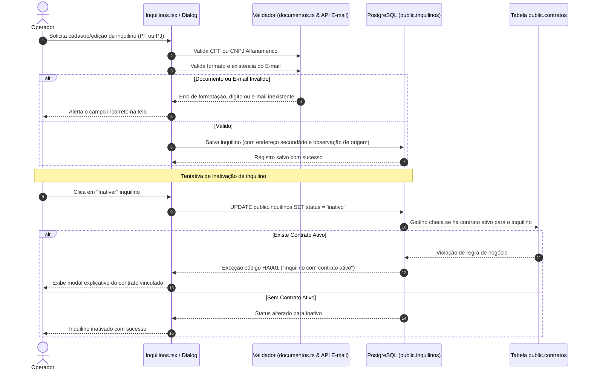
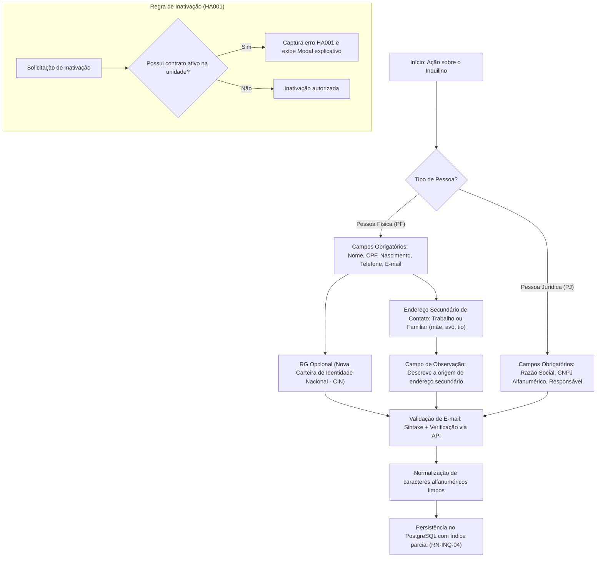

[[_TOC_]]

## Objetivo
Governar o cadastro completo, qualificação e histórico de locatários (Pessoas Físicas e Pessoas Jurídicas), assegurando a validação de documentos fiscais conforme as normas federais vigentes (inclusive CNPJ alfanumérico e RG facultativo pela nova CIN), endereço de contato secundário com rastreio de origem e garantindo a impossibilidade de inativação ou exclusão de inquilinos com contratos de locação em vigência.

## Contexto  
  
O módulo de Inquilinos é fundamental para a formalização contratual e cobrança na Águia Systems. Os locatários podem ser indivíduos (PF) ou empresas (PJ).  

Conforme alinhamento estratégico, a proporção padrão do sistema é de **1 inquilino por unidade vinculada**. O cadastro físico (PF) foi modernizado para refletir a **Nova Carteira de Identidade Nacional (CIN)**, tornando o campo RG opcional, uma vez que o CPF é o identificador único nacional. Além disso, incorporou-se a exigência de **endereço de contato secundário** (comercial/trabalho ou de familiares como mãe, avô ou tio) com observação da origem, aumentando a recuperabilidade de contato para cobrança.  

A persistência reside na tabela `public.inquilinos` ([`…_tabelas.sql`](file:///Users/francisco.junior/Documents/antigravity/charming-salk/supabase/migrations/20260917120002_tabelas.sql)), com unicidade assegurada por índices únicos parciais. A interface é provida por [`Inquilinos.tsx`](file:///Users/francisco.junior/Documents/antigravity/charming-salk/src/pages/Inquilinos.tsx) e [`InquilinoFormDialog.tsx`](file:///Users/francisco.junior/Documents/antigravity/charming-salk/src/components/inquilinos/InquilinoFormDialog.tsx), orquestrada pelo serviço [`inquilinos.ts`](file:///Users/francisco.junior/Documents/antigravity/charming-salk/src/services/inquilinos.ts).

---  
  
## Fluxo Atual (Cadastro e Ciclo de Inativação)  
 

---  
  
### O Problema  
  
Durante a operação diária e evolução do sistema, identificaram-se fragilidades no tratamento de erros e atualização cadastral:
  
| Cenário | Comportamento esperado | Comportamento real (Legado) |  
|---|---|---|  
| Inativação de inquilino com contrato vigente | Bloqueio imediato explicando o motivo: "Inquilino vinculado ao contrato nº X na unidade Y" | O banco recusava corretamente (`HA001`), mas a lista capturava o erro de forma genérica: *"Não foi possível inativar o inquilino. Tente novamente."* |  
| Exigência de RG no cadastro PF | RG facultativo, pois o CPF é o número único oficial do cidadão (Lei 14.534/2023 - CIN) | O sistema tratava o RG como obrigatório, bloqueando cadastros de cidadãos que já utilizavam a nova identidade unificada |  
| Perda de contato com inquilino inadimplente | Localização via endereço de contato secundário (trabalho ou familiar) com observação da origem | Sem endereço secundário cadastrado, a cobrança ficava restrita ao endereço do próprio imóvel alugado |  
| Validação de novos CNPJs alfanuméricos | Aceitação de letras nas 12 primeiras posições e validação dos dígitos conforme IN RFB 2.229/2024 | Validadores de CNPJ tradicionais aceitavam apenas dígitos numéricos, rejeitando novas empresas legalizadas a partir de julho/2026 |  
| E-mail com erro de digitação (`.cmo`, provedor inexistente) | Validação sintática e verificação de MX/existência de e-mail na entrada | E-mails inválidos eram salvos, inviabilizando posterior envio da minuta contratual para assinatura digital |  
  
**Resultado:** Dificuldade do operador para entender por que uma inativação não ocorria, barreiras desnecessárias no cadastro de RG e risco de perda de contato para cobrança.  
  
---  
  
## Fluxo Proposto (V2 — Validação Unificada, Nova Identidade e Endereço Secundário)  
  

---  

## Rastreabilidade e Ciclo de Vida do Inquilino

O ciclo de vida cadastral e operacional do inquilino é governado por estados estritos:  
**`ATIVO_DISPONIVEL ⇄ ATIVO_LOCATARIO ⇄ INATIVO`**  
  
| Transição | Quando ocorre |  
|---|---|  
| `(cadastro)` → `ATIVO_DISPONIVEL` | Inquilino criado no sistema sem nenhum contrato ou unidade vinculada |  
| `ATIVO_DISPONIVEL` → `ATIVO_LOCATARIO` | Ativação de contrato de locação vinculando o inquilino à unidade (`RN-IMV-01`) |  
| `ATIVO_LOCATARIO` → `ATIVO_DISPONIVEL` | Término, rescisão ou encerramento formal de todos os seus contratos vigentes |  
| `ATIVO_DISPONIVEL` → `INATIVO` | Operador inativa o cadastro para que ele não apareça em novas seleções de contratos |  
| `ATIVO_LOCATARIO` → `INATIVO` | **Bloqueado pelo banco (`HA001`)** — proibido enquanto houver contrato ativo |  

### **1. Campos do Cadastro PF e PJ (Especificação de Dados)**  
  
- **Pessoa Física (PF):**
  - **Obrigatórios:** Nome Completo, CPF (com dígito verificador), Data de Nascimento, Telefone e E-mail.
  - **Opcionais:** RG (facultativo devido à CIN), Órgão Emissor.
  - **Endereço Principal:** Endereço residencial de origem.
  - **Endereço de Contato Secundário:** Endereço comercial/trabalho ou de familiar próximo (mãe, pai, avô, tio).
  - **Observação do Endereço Secundário:** Texto livre indicando a titularidade (ex.: *"Endereço da mãe do locatário, Sra. Maria"*).
- **Pessoa Jurídica (PJ):**
  - **Obrigatórios:** Razão Social, CNPJ (com suporte a caracteres alfanuméricos nas 12 primeiras posições - IN RFB 2.229/2024), Nome do Responsável Legal, Telefone e E-mail.
  - **Opcionais:** Nome Fantasia, Inscrição Estadual.
  
### **2. Validação de E-mail e Proteção Transacional de Inativação (`HA001`)**  
  
| Tentativa de Operação | Validação de Banco / Serviço | Ação da Interface |  
|---|---|---|  
| E-mail digitado no cadastro | Validação de expressão regular + checagem de sintaxe MX | Impede submissão e sugere correção de domínios digitados incorretamente |  
| Inativar locatário com contrato vigente | Trigger interrompe com código `HA001` | Interface exibe modal informativo apontando o contrato e unidade vinculados |  
| Excluir locatário com histórico financeiro | Foreign key com `on delete restrict` impede a deleção | Exclusão física é bloqueada; orienta inativação lógica |  

---

## Comparativo V1 x V2
  
| Critério | V1 —> Cadastro Básico | V2 —> Cadastro Águia Systems |  
|---|---|---|  
| Identificação PF | RG obrigatório rígido | RG facultativo (alinhado à Nova Carteira de Identidade - CIN) |  
| Contato de Segurança | Apenas 1 endereço residencial | Endereço secundário (trabalho/familiar) + observação da fonte |  
| Validador de CNPJ | Apenas dígitos numéricos tradicionais | Suporte pleno ao CNPJ alfanumérico da Receita Federal |  
| Validação de E-mail | Apenas regex simples de formato | Validação com verificação de provedor para envio de minutas |  
| Mensagem de erro ao inativar | Genérica ("Não foi possível inativar") | Explicativa e contextualizada com o código `HA001` |  

---  
  
## Importante (Impacto e Observações)
  
- **Proporção por Unidade:** A regra de negócio padrão estabelece a vinculação de **1 inquilino principal por unidade habitacional/comercial** no contrato de locação.  
- **Preservação de Registros:** Inquilinos nunca devem ser fisicamente excluídos do banco de dados quando já tiverem histórico financeiro (recibos, receitas ou contratos anteriores), garantindo sustentação documental fiscal.
