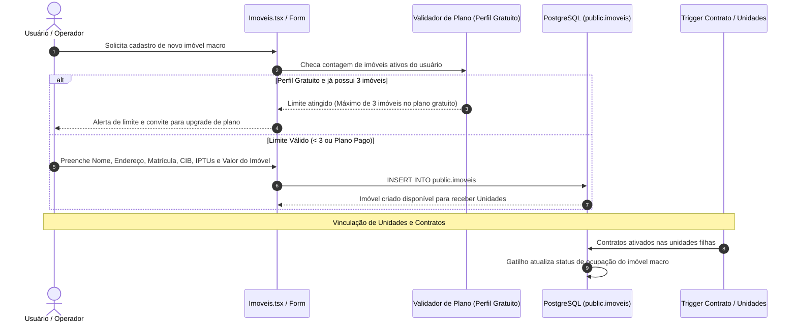
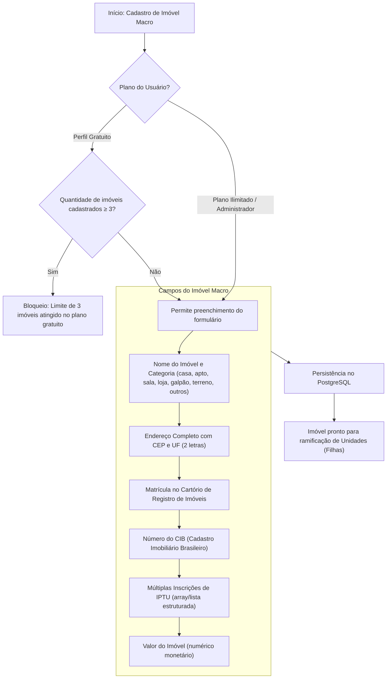

[[_TOC_]]

## Objetivo
Centralizar o inventário macro do patrimônio imobiliário da Águia Systems, gerenciando dados físicos e cartorários fundamentais (matrícula, número CIB, múltiplos cadastros de IPTU, endereço e valor do imóvel), aplicando a regra de limite para o perfil gratuito (até 3 imóveis) e servindo como o nó primário na árvore hierárquica de unidades e contratos.

## Contexto  
  
O portfólio da plataforma opera em estrutura de dois níveis: o **Imóvel Macro** (casa, prédio, condomínio, galpão ou terreno) e suas **Unidades Locáveis** vinculadas.  

Conforme definição de negócio:
- **Limite do Perfil Gratuito:** O sistema restringe o cadastro a **até 3 imóveis** para contas gratuitas.
- **Categorias Oficiais:** Casa, Apartamento, Sala Comercial, Loja, Galpão, Terreno e Outros.
- **Status Operacionais:** Vago, Alugado, Em Manutenção e Inativo.
- **Ajuste de Nomenclatura:** O campo patrimonial de avaliação é padronizado como **"Valor do Imóvel"**.
- **Divisões Fiscais Múltiplas:** O imóvel macro suporta o registro do **número CIB** (Cadastro Imobiliário Brasileiro), da **matrícula no cartório de registro** e de **múltiplos números de IPTU** (para atender terrenos com desmembramentos fiscais pela prefeitura).  

Os dados residem na tabela `public.imoveis` ([`…_tabelas.sql`](file:///Users/francisco.junior/Documents/antigravity/charming-salk/supabase/migrations/20260917120002_tabelas.sql)), com as imagens salvas no bucket privado `imoveis-fotos`. A camada de apresentação é provida por [`Imoveis.tsx`](file:///Users/francisco.junior/Documents/antigravity/charming-salk/src/pages/Imoveis.tsx) e [`ImovelFormDialog.tsx`](file:///Users/francisco.junior/Documents/antigravity/charming-salk/src/components/imoveis/ImovelFormDialog.tsx).

---  
  
## Fluxo Atual (Cadastro Macro e Governança de Limite Gratuito)  
 

---  
  
### O Problema  
  
Nas versões anteriores e durante o diagnóstico de inventário funcional, foram levantados pontos críticos de negócio e tributários:
  
| Cenário | Comportamento esperado | Comportamento real (Legado) |  
|---|---|---|  
| Usuário no plano gratuito cadastra 4º imóvel | Bloqueio claro na interface informando o teto de 3 imóveis | Não havia checagem de cota gratuita; o usuário criava registros ilimitados |  
| Imóvel com múltiplos carnês de IPTU no mesmo terreno | Armazenamento de lista de inscrições de IPTU vinculadas à mesma matrícula | O sistema possuía apenas um campo de texto único para IPTU, forçando o operador a concatenar com vírgulas |  
| Integração com a Receita Federal / CIB | Campo dedicado para o CIB (Cadastro Imobiliário Brasileiro) | Inexistente; o número do CIB ficava perdido no campo livre de observações |  
| Nomenclatura ambígua de valor ("valor", "valor estimado") | Campo único e padronizado: "Valor do Imóvel" | Confusão entre valor de locação e valor patrimonial de venda/avaliação |  
| Inativação de imóvel com contrato ativo em suas unidades | Bloqueio imediato indicando as unidades locadas pendentes | Mensagem genérica de erro que não explicitava o vínculo contratual |  
  
**Resultado:** Dificuldade na fiscalização tributária (CIB e IPTU múltiplos) e ausência de barreira comercial de monetização (limite de 3 imóveis).  
  
---  
  
## Fluxo Proposto (V2 — Estrutura Macro com CIB, Múltiplos IPTUs e Limite Comercial)  
  

---  

## Rastreabilidade e Ciclo de Vida do Imóvel Macro

O imóvel macro segue uma máquina de estados atrelada ao conjunto de suas unidades:  
**`VAGO ⇄ ALUGADO ⇄ EM_MANUTENCAO ⇄ INATIVO`**  
  
| Transição | Quando ocorre |  
|---|---|  
| `(criação)` → `VAGO` | Imóvel inserido no sistema; consome 1 slot da cota de até 3 imóveis do perfil gratuito |  
| `VAGO` → `ALUGADO` | Automática quando suas unidades atingem ocupação total por contratos ativos |  
| `ALUGADO` → `VAGO` | Automática quando todas as unidades tornam-se desocupadas |  
| `VAGO` ⇄ `EM_MANUTENCAO` | Ação manual do operador para reformas estruturais na edificação |  
| `VAGO` / `MANUTENCAO` → `INATIVO` | Imóvel desincorporado; libera 1 slot da cota gratuita |  
| `ALUGADO` → `INATIVO` | **Bloqueio rígido pelo banco (`HA001`)** — proibido enquanto houver contrato ativo |  

### **1. Estrutura Fiscal e Cartorária Padronizada**  
  
- **Matrícula do Imóvel:** Código oficial do Cartório de Registro de Imóveis da circunscrição imobiliária competente.  
- **Número CIB:** Identificador único da base da Receita Federal do Brasil (Cadastro Imobiliário Brasileiro), essencial para conformidade com a Reforma Tributária (IBS/CBS).  
- **Múltiplos IPTUs:** Suporte a array estruturado `iptus: text[]` permitindo associar 2 ou mais cadastros fiscais municipais a um mesmo imóvel macro (ex.: prédios com divisões fiscais anteriores ou lotes unificados).  
- **Valor do Imóvel:** Representação monetária em `numeric(14,2)` indicando o valor venal ou de mercado do ativo patrimonial.  
  
### **2. Validação da Cota do Perfil Gratuito**  
  
| Regra Comercial | Validação do Sistema | Ação da Interface |  
|---|---|---|  
| Usuário com 0 a 2 imóveis | Contagem via query RLS `count(id) < 3` | Permite botão "Novo Imóvel" e salva normalmente |  
| Usuário com 3 imóveis tenta criar o 4º | Função de guarda no banco e bloqueio no frontend | Desabilita formulário e apresenta banner de plano profissional |  
| Usuário inativa 1 imóvel | O imóvel inativo não conta como ativo comercial se excluído/arquivado | Permite cadastrar um novo imóvel substituto |  

---

## Comparativo V1 x V2
  
| Critério | V1 —> Imóvel Monolítico | V2 —> Imóvel Macro Águia Systems |  
|---|---|---|  
| Limite Comercial | Sem limite ou controle de cota | Limite gratuito estrito de até 3 imóveis |  
| Cadastro Fiscal | Apenas 1 IPTU genérico | Múltiplos IPTUs suportados por imóvel |  
| CIB (Receita Federal) | Inexistente | Campo formalizado do Cadastro Imobiliário Brasileiro |  
| Nomenclatura de Valor | "valor", "valor estimado" | "Valor do Imóvel" padronizado |  
| Papel na Arquitetura | Entidade isolada sem subunidades | Nó raiz/primário da árvore hierárquica |  

---  
  
## Importante (Impacto e Observações)
  
- **Hierarquia Imóvel x Unidade:** O imóvel macro não assina contrato diretamente quando possui unidades autônomas registradas; os contratos são atrelados às **unidades filhas** ([`05-unidades.md`](05-unidades.md)).  
- **Auditoria Patrimonial:** Toda modificação no CIB, matrícula ou inscrições de IPTU gera log na trilha de auditoria com "de → para" para acompanhamento dos sócios.
