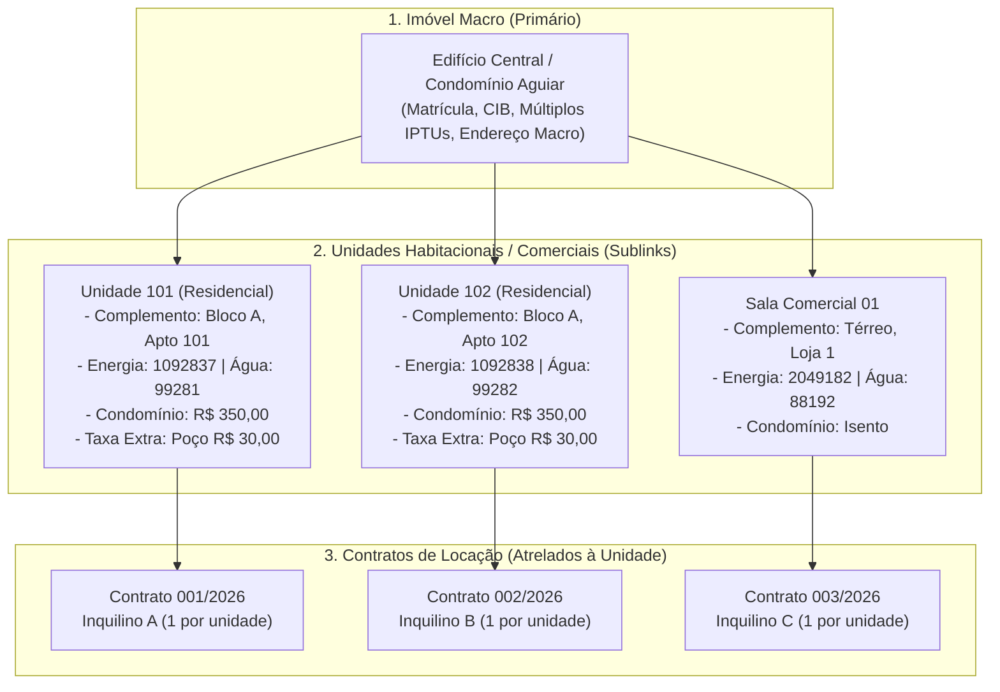
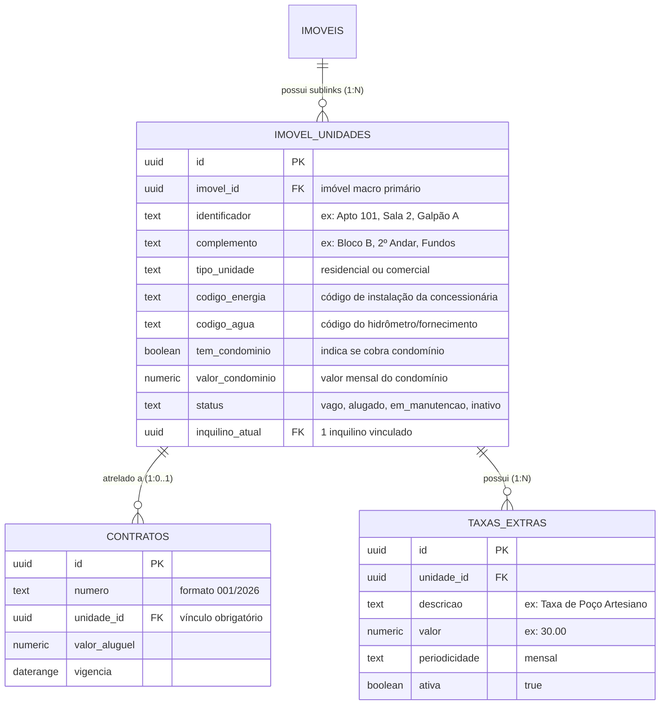

[[_TOC_]]

## Objetivo
Governar a estrutura de unidades habitacionais e comerciais vinculadas a um imóvel macro na Águia Systems, gerenciando dados operacionais específicos (complemento, códigos de energia e água, taxa de condomínio e taxas extras customizáveis como taxa de poço), servindo como o nó intermediário da árvore hierárquica onde os contratos de locação são atrelados com a proporção padrão de 1 inquilino por unidade.

## Contexto  
  
Conforme definição estratégica entre Francisco Ferreira Jr e Jacqueline Moraes de Aguiar, o sistema opera sob uma **árvore hierárquica estrita**:  
1. **Imóvel Macro (Primário):** Prédio, condomínio, vila, galpão ou terreno.  
2. **Unidades (Sublinks):** Unidades habitacionais ou comerciais individuais vinculadas ao imóvel macro.  
3. **Contratos:** Atrelados diretamente à **unidade**, e não ao imóvel macro.  

Esta separação atende cenários reais de condomínios, vilas e prédios comerciais, eliminando a limitação na quantidade total de inquilinos na holding (já que cada unidade recebe seu próprio inquilino e contrato independente).  

Além dos dados físicos básicos, o cadastro da unidade incorpora elementos operacionais essenciais para a cobrança do aluguel e despesas de consumo:
- **Complemento do Endereço:** Bloco, andar, número da sala, apartamento ou fundos.
- **Códigos de Fornecimento de Concessionárias:** Código da conta de energia elétrica e código da conta de água (para controle de titularidade e religação).
- **Taxa de Condomínio:** Flag de existência (Sim/Não) e valor mensal.
- **Taxas Extras Customizáveis:** Lançamento de despesas fixas recorrentes do condomínio/vila, com o exemplo acordado da **Taxa de Poço Artesiano de R$ 30,00 mensais**.

---  
  
## Fluxo Atual vs Proposto (Estrutura Hierárquica em 2 Níveis)  
 

---  
  
### O Problema  
  
O modelo anterior não comportava a complexidade de vilas e prédios fracionados:
  
| Cenário | Comportamento esperado | Comportamento real (Legado) |  
|---|---|---|  
| Prédio com 6 apartamentos e poço artesiano | Cadastro de 1 imóvel macro e 6 unidades, cada uma com sua taxa de condomínio e taxa de poço de R$ 30 | O operador precisava criar 6 imóveis independentes e calcular o poço de cabeça ou em planilha externa |  
| Transferência de titularidade de energia e água | Armazenamento do código do medidor/fornecimento na unidade para conferência rápida | Os códigos das concessionárias ficavam em pastas de arquivo ou anotações físicas |  
| Aluguel de 2 salas no mesmo andar | Contratos simultâneos ativos sem conflito temporal | A restrição GiST do banco barrava o 2º contrato porque o imóvel era tratado como peça única |  
| Proporção de ocupantes por unidade | 1 inquilino titular responsável formalmente por contrato de unidade | Indefinição sobre quem respondia pelo contrato em imóveis compartilhados |  
  
**Resultado:** Desorganização na prestação de contas de consumo (água e luz), impossibilidade de gerenciar taxas específicas da comunidade (como poço) e barreiras técnicas na emissão de contratos simultâneos.  
  
---  
  
## Fluxo Proposto (V2 — Modelagem da Unidade e Taxas Operacionais)  
  

---  

## Rastreabilidade e Ciclo de Vida da Unidade

O ciclo de vida da unidade habitacional ou comercial é independente das demais unidades do mesmo imóvel:  
**`VAGA ⇄ ALUGADA ⇄ EM_MANUTENCAO ⇄ INATIVA`**  
  
| Transição | Quando ocorre |  
|---|---|  
| `(criação)` → `VAGA` | Unidade cadastrada com seus códigos de energia, água e taxas associadas |  
| `VAGA` → `ALUGADA` | Ativação de contrato de locação apontando para a unidade com 1 inquilino vinculado |  
| `ALUGADA` → `VAGA` | Encerramento ou rescisão do contrato de locação da unidade |  
| `VAGA` ⇄ `EM_MANUTENCAO` | Indicação de reformas, pintura ou troca de fiação/encanamento na unidade |  
| `VAGA` → `INATIVA` | Desativação da unidade (ex: reintegração da área a outra unidade) |  

### **1. Taxas de Condomínio e Taxas Extras Customizáveis**  
  
- **Taxa de Condomínio:**
  - Se `tem_condominio = true`, o campo `valor_condominio` torna-se obrigatório. Esse valor é somado na composição da cobrança mensal enviada ao inquilino.
- **Taxas Extras Customizáveis (`TAXAS_EXTRAS`):**
  - Permite adicionar N taxas fixas vinculadas à unidade.
  - Caso padrão implementado: **Taxa de Poço Artesiano** (R$ 30,00/mês), cobrada em imóveis que compartilham poço em substituição ou complemento à rede pública.
  - Outras taxas suportadas: Taxa de Limpeza de Fossa, Fundo de Reserva, Internet Coletiva.
  
### **2. Códigos de Fornecimento de Água e Energia**  
  
| Campo | Finalidade Operacional | Validação |  
|---|---|---|  
| `codigo_energia` | Identificador da conta de energia elétrica (instalação/unidade consumidora) | Texto alfanumérico, visível na ficha da unidade |  
| `codigo_agua` | Identificador da conta de água/saneamento (hidrômetro/RGI) | Texto alfanumérico, visível na ficha da unidade |  
| Vistoria de Saída | Verificação de débitos nas concessionárias pelo código | Permite ao operador consultar débitos pendentes no encerramento |  

---

## Comparativo V1 x V2
  
| Critério | V1 —> Imóvel Plano | V2 —> Árvore Hierárquica Águia Systems |  
|---|---|---|  
| Estrutura de Cadastro | 1 nível apenas | 2 níveis: Imóvel Macro → Unidades Filhas |  
| Vínculo do Contrato | Direto no Imóvel | Atrelado à Unidade específica |  
| Códigos de Energia e Água | Inexistentes | Armazenados por unidade para gestão de consumo |  
| Gestão de Condomínio | Apenas despesa genérica | Taxa de condomínio parametrizada na unidade |  
| Taxas Extras Customizáveis | Não suportadas | Suporte a taxas como taxa de poço (R$ 30,00) |  
| Proporção de Inquilinos | Ambígua | 1 inquilino vinculado por unidade |  

---  
  
## Importante (Impacto e Observações)
  
- **Escalabilidade Sem Limite de Inquilinos:** A holding pode gerenciar dezenas de inquilinos em um único imóvel macro (como um condomínio de vilas ou prédio), pois a validação de sobreposição temporal opera por `unidade_id`.  
- **Composição da Cobrança:** O valor total da cobrança mensal da unidade passa a ser calculado pela fórmula:  
  $$\text{Total Mensal} = \text{Aluguel} + \text{Condomínio (se houver)} + \sum(\text{Taxas Extras (ex: Poço)})$$  
- **Facilidade em Vistorias:** Os códigos das concessionárias impressos no contrato e na ficha da unidade agilizam a conferência de quitação de água e luz na entrega das chaves.
