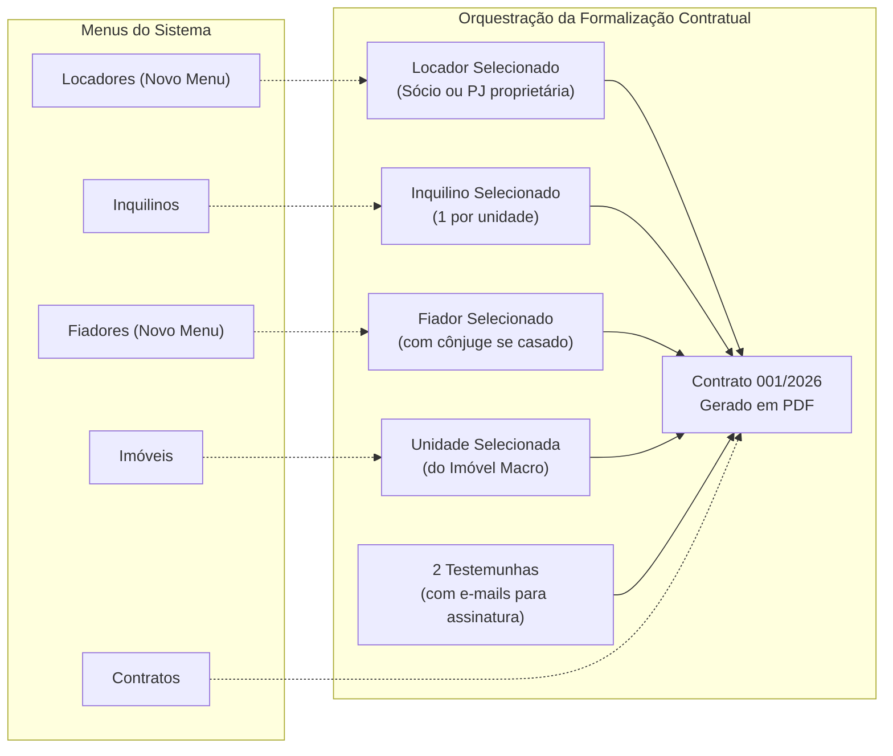
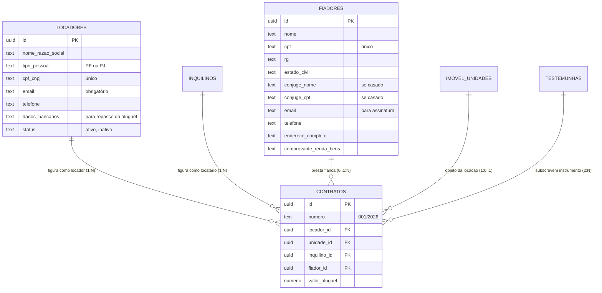

[[_TOC_]]

## Objetivo
Governar a gestão cadastral, papéis jurídicos e menus dedicados de todas as partes intervenientes nas operações da Águia Systems — incluindo novo **Menu Lateral para Locadores**, cadastro de **Fiadores**, **Inquilinos** e qualificação de **Testemunhas** —, permitindo a combinação precisa entre Locador, Imóvel, Unidade, Inquilino e Fiador na formalização contratual e assegurando eficácia de título executivo (CPC, art. 784, III).

## Contexto  
  
Conforme alinhamento estratégico entre Francisco Ferreira Jr e Jacqueline Moraes de Aguiar, os imóveis gerenciados pertencem a diferentes membros da família e holdings patrimoniais. Por essa razão, **ficou formalmente decidido criar um novo menu lateral para o cadastro de Locadores**, separando a titularidade dos bens da operação do sistema.  

Da mesma forma, foi aprovada a implementação do cadastro específico de **Fiadores**, viabilizando minutas contratuais que utilizem fiança como modalidade de garantia com as devidas outorgas conjugais.  

Com isso, a formalização de um contrato de locação passa a orquestrar uma combinação relacional clara:  
$$\text{Contrato} = \text{Locador} + \text{Imóvel} + \text{Unidade} + \text{Inquilino} + \text{Fiador (se houver)} + \text{2 Testemunhas}$$

---  
  
## Fluxo Atual vs Proposto (Novo Menu Lateral e Combinação Contratual)  
 

---  
  
### O Problema  
  
Antes desta definição, a falta de segregação de locadores e fiadores gerava limitações práticas:
  
| Cenário | Comportamento esperado | Comportamento real (Legado) |  
|---|---|---|  
| Imóveis com proprietários familiares diferentes (irmãos, pais, holding) | Seleção direta do Locador no cadastro do contrato via menu próprio de Locadores | O sistema não tinha cadastro de locadores; assumia tacitamente a mesma entidade em todos os contratos |  
| Contrato com garantia de fiança | Cadastro estruturado do Fiador com qualificação, bens e dados do cônjuge | Fiador era apenas uma string de texto nas observações do contrato |  
| Emissão de minutas contratuais automatizadas | Preenchimento automático dos dados do Locador e Fiador no cabeçalho e encerramento | A operadora precisava exportar o documento para o Word e digitar os dados do locador e fiador manualmente |  
| Assinatura digital das partes | Coleta automática do e-mail do Locador, Inquilino, Fiador e Testemunhas | E-mails dispersos e não validados no momento do cadastro |  
  
**Resultado:** Risco de contratos emitidos com dados de locador incorretos e fragilidade jurídica em execuções de garantia de fiadores.  
  
---  
  
## Fluxo Proposto (V2 — Menus Dedicados e Relacionamento Contratual)  
  

---  

## Rastreabilidade e Ciclo de Vida dos Cadastros

Cada tipo de participante possui ciclo de vida próprio e validações direcionadas:  
  
### **1. Menu e Cadastro de Locadores**  
- **Finalidade:** Cadastrar as pessoas físicas (sócios, herdeiros) ou pessoas jurídicas que detêm a posse ou propriedade dos imóveis.
- **Campos Obrigatórios:** Nome/Razão Social, CPF/CNPJ, Telefone, E-mail (para assinatura e envio de relatórios mensais) e Dados Bancários (chave PIX/banco para repasse financeiro).
- **Acesso:** Menu lateral próprio posicionado estrategicamente ao lado de Imóveis e Inquilinos.

### **2. Cadastro de Fiadores**  
- **Finalidade:** Cadastrar os garantidores que responderão solidariamente pelas obrigações locatícias.
- **Outorga Conjugal (Art. 1.647, III do Código Civil):**
  - Se o estado civil for Casado ou União Estável, o formulário exige o Nome e CPF do Cônjuge para anuência expressa.
- **E-mail Obrigatório:** Essencial para inclusão na esteira de assinatura eletrônica do contrato.

### **3. Qualificação de Testemunhas**  
- **Exigência Legal (CPC art. 784, III):** Exige 2 testemunhas instrumentárias para que o contrato tenha força de título executivo extrajudicial imediato.
- **Campos:** Nome Completo, CPF e E-mail de cada testemunha.

---

## Comparativo V1 x V2
  
| Critério | V1 —> Apenas Inquilinos | V2 —> Menus Dedicados Águia Systems |  
|---|---|---|  
| Menu de Locadores | Inexistente (imóvel sem dono definido) | Menu lateral dedicado com dados cadastrais e bancários |  
| Cadastro de Fiador | Campo de texto livre | Formulário estruturado com outorga uxória do cônjuge |  
| Geração Contratual | Word manual para preencher locador | Montagem automática: Locador + Unidade + Inquilino + Fiador |  
| Envio de Relatórios | Sem destinatário de repasse | Envio automatizado de demonstrativos para o e-mail do Locador |  
| Segurança Jurídica | Ausência de qualificação formal | Plena eficácia executiva com fiador e 2 testemunhas |  

---  
  
## Importante (Impacto e Observações)
  
- **Independência Familiar:** Como os imóveis pertencem a diferentes parentes da família Aguiar, cada contrato apontará o Locador exato responsável por aquele imóvel, facilitando a contabilidade individual e o informe de rendimentos no IRPF.  
- **Políticas de Acesso (RLS):** Administradores têm visão plena de todos os locadores; usuários operacionais só editam locadores se possuírem permissão de edição no módulo.
