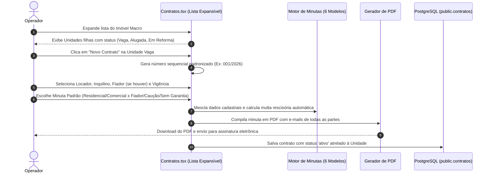
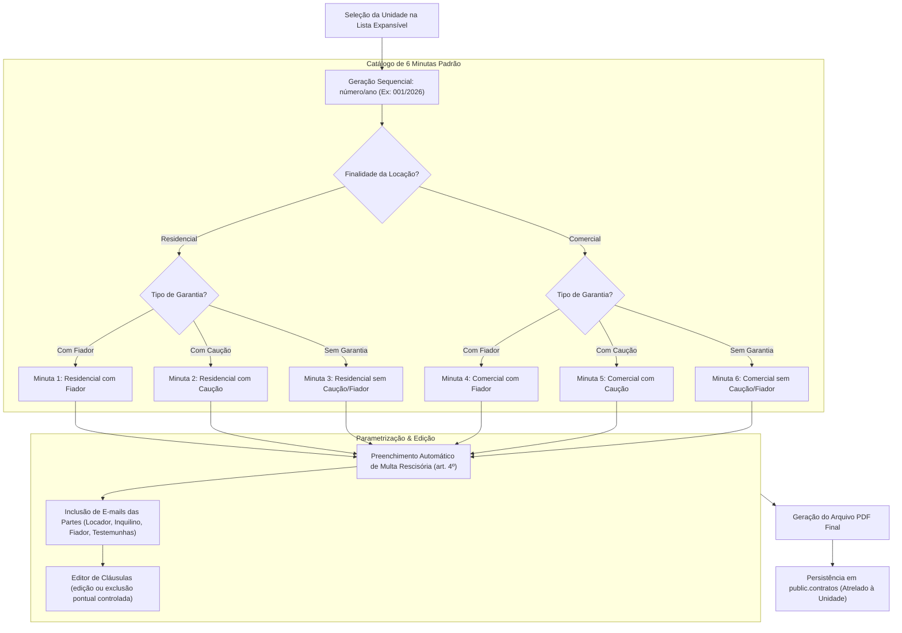

[[_TOC_]]

## Objetivo
Governar a gestão, formalização e ciclo de vida dos contratos de locação da Águia Systems, estruturando a relação na árvore hierárquica (Imóvel → Unidade → Inquilino), aplicando numeração sequencial padronizada no formato `número/ano` (ex.: `001/2026`), disponibilizando interface em lista expansível e gerando documentos PDF a partir de 6 minutas padrão com inclusão dos e-mails das partes envolvidas para assinatura digital.

## Contexto  
  
Conforme diretrizes alinhadas entre Francisco Ferreira Jr e Jacqueline Moraes de Aguiar:
1. **Árvore Hierárquica:** O contrato vincula a **Unidade** (e não o imóvel macro como um todo) a um **Inquilino**, associando o **Locador** titular do bem e o **Fiador** (quando aplicável).
2. **Numeração Sequencial:** Padronizada obrigatoriamente no formato `número/ano` (exemplo: `001/2026`, `002/2026`), reiniciando ou sequenciando por exercício fiscal.
3. **Interface em Lista Expansível:** A tela exibe as unidades em visualização hierárquica expansível, apresentando o status da unidade e atalhos diretos para emissão do contrato.
4. **Minutas Padronizadas:** O sistema integrará **seis minutas padrão de contrato** elaboradas para cobrir as combinações operacionais da holding:
   - *Residencial:* Com Fiador, Com Caução, Sem Garantia.
   - *Comercial:* Com Fiador, Com Caução, Sem Garantia.
5. **Geração em PDF com E-mails:** Emissão automática de minutas em PDF contendo expressamente a qualificação e os endereços de e-mail de todas as partes (Locador, Inquilino, Fiador e Testemunhas) para integração com plataformas de assinatura eletrônica.
6. **Personalização de Cláusulas:** Preenchimento automático de multas rescisórias (art. 4º da Lei 8.245/1991) e capacidade controlada de editar ou excluir cláusulas específicas.

---  
  
## Fluxo Atual (Lista Expansível e Emissão de Contrato em PDF)  
 

---  
  
### O Problema  
  
Nas versões anteriores, o fluxo de contratos apresentava gargalos operacionais e manuais:
  
| Cenário | Comportamento esperado | Comportamento real (Legado) |  
|---|---|---|  
| Numeração de contratos | Formato uniforme sequencial `número/ano` (ex.: `001/2026`) | Campo de texto livre, gerando numerações despadronizadas como "CTR-1", "Contrato Loja", "12/25" |  
| Seleção de minuta contratual | Escolha entre as 6 minutas padrão homologadas pelo jurídico da família | Digitação manual de contratos no Word a partir de modelos antigos desatualizados |  
| Visualização de unidades alugadas no condomínio | Lista expansível por imóvel macro com badges de status das unidades | Tabela plana com repetição do nome do imóvel em dezenas de linhas desordenadas |  
| Envio para assinatura eletrônica | Documento gerado já contendo e-mails formais de todas as partes qualificadas | Falta de e-mails no corpo do documento, exigindo preenchimento manual na plataforma de assinatura |  
| Cálculo de multa proporcional rescisória | Cálculo automático da multa de 3 meses proporcional ao período restante (Lei 8.245, art. 4º) | Cálculo manual sujeito a erros de interpretação aritmética |  
  
**Resultado:** Risco de inconsistências contratuais, morosidade na emissão de minutas e perda de padronização nas garantias acordadas.  
  
---  
  
## Fluxo Proposto (V2 — Minutas Parametrizadas e Emissão Automatizada)  
  

---  

## Rastreabilidade e Ciclo de Vida do Contrato

A máquina de estados contratual opera ancorada na unidade correspondente:  
**`MINUTA_RASCUNHO → AGUARDANDO_ASSINATURA → ATIVO → EM_REAJUSTE → ENCERRADO | RESCINDIDO`**  
  
| Transição | Quando ocorre |  
|---|---|  
| `(criação)` → `MINUTA_RASCUNHO` | Seleção da minuta padrão e preenchimento dos dados; gera numeração `001/2026` |  
| `MINUTA_RASCUNHO` → `AGUARDANDO_ASSINATURA` | Emissão do PDF contendo os e-mails das partes; disparado para assinatura digital |  
| `AGUARDANDO_ASSINATURA` → `ATIVO` | Instrumento assinado por todas as partes; a unidade passa automaticamente para `alugada` |  
| `ATIVO` → `EM_REAJUSTE` | Chegada da data de aniversário de 12 meses para aplicação de índice monetário |  
| `ATIVO` → `ENCERRADO` | Término do prazo contratual com entrega das chaves e quitação das contas de água e luz |  
| `ATIVO` → `RESCINDIDO` | Encerramento antecipado com cobrança de multa proporcional calculada automaticamente |  

### **1. O Catálogo de 6 Minutas Padrão**  
  
1. **Residencial com Fiador:** Inclui qualificação do fiador e outorga conjugal expressa.  
2. **Residencial com Caução:** Limite de até 3 aluguéis depositados em conta poupança vinculada (art. 38, § 2º da Lei 8.245).  
3. **Residencial sem Garantia:** Locação desprovida de garantia, aplicando o benefício legal de despejo liminar em 15 dias (art. 59, § 1º, IX da Lei 8.245).  
4. **Comercial com Fiador:** Cláusulas de destinação comercial e responsabilidade solidária de fiador.  
5. **Comercial com Caução:** Caução vinculada a reparos e devolução do imóvel comercial nas condições originais.  
6. **Comercial sem Garantia:** Sem caução e sem fiador, com previsão expressa de cobrança e purgação de mora célere.  

### **2. Numeração Sequencial `número/ano`**  
  
- O campo `numero` adota máscara e gerador sequencial automático: `LPAD(contador, 3, '0') || '/' || TO_CHAR(now(), 'YYYY')`.  
- Exemplos: `001/2026`, `002/2026`, `015/2026`.  
- Mantém índice único no banco de dados para evitar duplicidade de contratos no mesmo exercício.  

---

## Comparativo V1 x V2
  
| Critério | V1 —> Contrato Tradicional | V2 —> Contrato Águia Systems |  
|---|---|---|  
| Numeração | Texto livre manual | Sequencial padronizado `número/ano` (ex.: `001/2026`) |  
| Modelos Contratuais | Arquivos externos no Word | 6 minutas padrão integradas ao sistema |  
| Visualização | Tabela corrida de linhas | Lista expansível por Imóvel Macro e Unidades |  
| E-mails das Partes | Ausentes no documento | Incluídos explicitamente no PDF para assinatura eletrônica |  
| Cálculo de Multa | Manual | Automatizado com base no art. 4º da Lei 8.245/1991 |  

---  
  
## Importante (Impacto e Observações)
  
- **Assinatura Eletrônica:** A presença explícita dos e-mails de todas as partes no PDF viabiliza a integração transparente com plataformas como Clicksign, DocuSign ou ZapSign sem digitação duplicada.  
- **Vínculo Exclusivo à Unidade:** O contrato vincula-se obrigatoriamente à `unidade_id`, permitindo que um mesmo imóvel macro (prédio ou condomínio) mantenha múltiplos contratos ativos simultaneamente sem qualquer conflito.  
- **Pauta da Próxima Reunião:** Ficou agendada reunião específica para aprofundar as permissões de edição e exclusão de cláusulas personalizadas no gerador de minutas.
